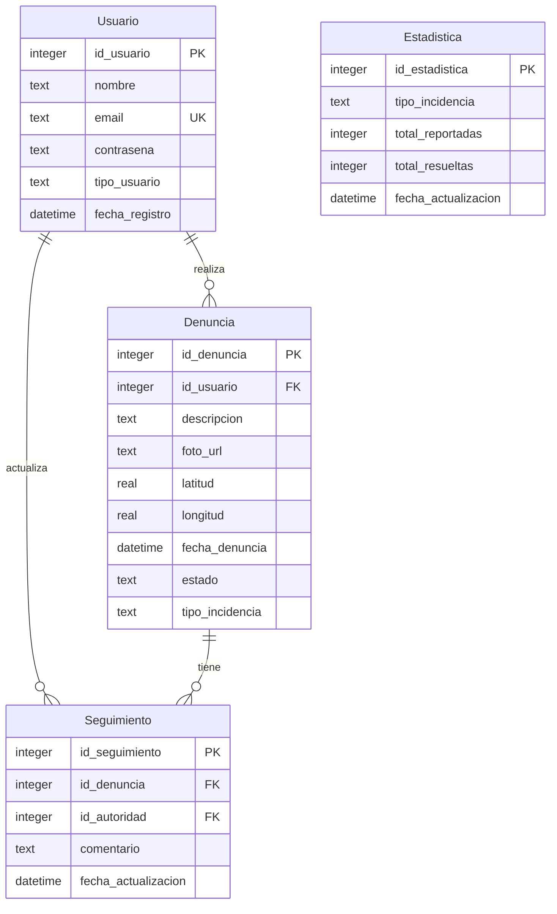

# 🏙️ DenunciaPE - Plataforma de Denuncia Ciudadana

[](https://reactjs.org/)
[](https://nodejs.org/)
[](https://www.sqlite.org/)
[](https://opensource.org/licenses/MIT)

Plataforma web para la denuncia ciudadana de problemas urbanos, permitiendo a los ciudadanos reportar incidencias y a las autoridades gestionar su seguimiento. Proyecto alineado con los **ODS 11** (Ciudades y Comunidades Sostenibles) y **ODS 16** (Paz, Justicia e Instituciones Sólidas).

## 📋 Descripción del Proyecto

DenunciaPE es una solución integral que conecta a ciudadanos con autoridades municipales para mejorar la calidad de vida urbana. Los usuarios pueden reportar problemas como baches, acumulación de basura, señalización defectuosa, alumbrado público dañado, entre otros, con geolocalización y evidencia fotográfica.

### Características Principales

- 🗺️ **Geolocalización**: Ubicación exacta de cada denuncia
- 📸 **Evidencia fotográfica**: Carga de imágenes para documentar problemas
- 📊 **Seguimiento en tiempo real**: Monitoreo del estado de denuncias
- 👥 **Gestión de autoridades**: Panel para atención y resolución
- 📈 **Estadísticas**: Métricas y análisis de incidencias
- 📱 **Diseño responsive**: Adaptable a cualquier dispositivo
- 🎨 **Interfaz moderna**: UX/UI intuitiva y atractiva

## 🚀 Tecnologías Utilizadas

### Frontend
- **React 18.3** - Biblioteca de UI
- **Vite** - Build tool y dev server
- **Lucide React** - Iconografía moderna
- **CSS3** - Estilos personalizados con gradientes y animaciones

### Backend
- **Node.js** - Entorno de ejecución
- **Express.js** - Framework web
- **SQLite3** - Base de datos relacional
- **CORS** - Gestión de peticiones cross-origin

### Herramientas de Desarrollo
- **Git** - Control de versiones
- **npm** - Gestión de dependencias
- **ESLint** - Linting de código

## 📁 Estructura del Proyecto

```
denuncia-app/
├── backend/
│   ├── database/
│   │   ├── schema.sql              # Esquema de la base de datos
│   │   ├── denuncia_ciudadana.db   # Base de datos SQLite
│   │   └── denuncia_ciudadana.sqbpro
│   ├── server.js                   # API REST (por implementar)
│   └── package.json                # Dependencias del backend
│
├── src/
│   ├── components/                 # Componentes reutilizables
│   │   ├── forms/
│   │   │   └── ComplaintForm.jsx   # Formulario de denuncias
│   │   ├── layout/
│   │   │   ├── Header.jsx          # Encabezado de la app
│   │   │   ├── Footer.jsx          # Pie de página
│   │   │   └── Layout.jsx          # Layout principal
│   │   └── ui/
│   │       ├── DenunciaCard.jsx    # Tarjeta de denuncia
│   │       ├── EstadoIcon.jsx      # Iconos de estado
│   │       ├── StatCard.jsx        # Tarjeta de estadísticas
│   │       └── StatusBadge.jsx     # Badge de estado
│   │
│   ├── pages/                      # Páginas principales
│   │   ├── Home.jsx                # Página de inicio
│   │   ├── NewComplaint.jsx        # Nueva denuncia
│   │   ├── ComplaintsList.jsx      # Lista de denuncias
│   │   └── Statistics.jsx          # Estadísticas
│   │
│   ├── hooks/
│   │   └── useComplaints.js        # Hook personalizado para denuncias
│   │
│   ├── services/
│   │   └── api.js                  # Servicios de API
│   │
│   ├── utils/
│   │   ├── constants.js            # Constantes de la app
│   │   └── mockData.js             # Datos de prueba
│   │
│   ├── styles.css                  # Estilos globales
│   ├── App.jsx                     # Componente principal
│   └── main.jsx                    # Punto de entrada
│
├── public/                         # Recursos estáticos
├── docs/                           # Documentación (diagramas, prototipos)
├── index.html                      # HTML principal
├── package.json                    # Dependencias del frontend
├── vite.config.js                  # Configuración de Vite
└── README.md                       # Este archivo
```

## 🗄️ Base de Datos

### Diagrama Entidad-Relación



### Entidades Principales

1. **Usuario**: Ciudadanos y autoridades del sistema
2. **Denuncia**: Reportes de problemas urbanos
3. **Seguimiento**: Historial de actualizaciones por autoridades
4. **Estadística**: Métricas agregadas del sistema

## 🔧 Instalación y Configuración

### Prerrequisitos

- Node.js 18+ ([Descargar](https://nodejs.org/))
- npm 9+ (incluido con Node.js)
- Git ([Descargar](https://git-scm.com/))
- SQLite3 (opcional, para gestión manual de BD)

### Clonar el Repositorio

```bash
git clone https://github.com/200946ds/Proyecto-de-Desarrollo-de-Software.git
cd Proyecto-de-Desarrollo-de-Software
```

### Instalar Dependencias

#### Frontend
```bash
npm install
```

#### Backend
```bash
cd backend
npm install
cd ..
```

### Configurar la Base de Datos

```bash
cd backend/database

# Crear la base de datos (si no existe)
sqlite3 denuncia_ciudadana.db < schema.sql

# Verificar que se creó correctamente
sqlite3 denuncia_ciudadana.db "SELECT name FROM sqlite_master WHERE type='table';"

cd ../..
```

## ▶️ Ejecutar el Proyecto

### Modo Desarrollo

Necesitarás **dos terminales** abiertas:

#### Terminal 1 - Backend
```bash
cd backend
npm run dev
```
El servidor estará disponible en: `http://localhost:3001`

#### Terminal 2 - Frontend
```bash
npm run dev
```
La aplicación estará disponible en: `http://localhost:5173`

### Modo Producción

```bash
# Construir el frontend
npm run build

# El backend servirá los archivos estáticos
cd backend
npm start
```

## 📖 Uso de la Aplicación

### Para Ciudadanos

1. **Registrar cuenta** - Crear un usuario ciudadano
2. **Nueva denuncia** - Reportar un problema urbano
   - Seleccionar tipo de incidencia
   - Describir el problema
   - Agregar foto (opcional)
   - Indicar ubicación
3. **Seguimiento** - Ver el estado de tus denuncias
4. **Estadísticas** - Consultar métricas de la ciudad

### Para Autoridades

1. **Tablero de gestión** - Vista de todas las denuncias
2. **Filtros** - Por tipo, estado, ubicación
3. **Actualizar estado** - Marcar como "en proceso" o "resuelta"
4. **Agregar comentarios** - Comunicación con ciudadanos

## 🎨 Capturas de Pantalla

### Página de Inicio
- Hero section con call-to-action
- Mapa interactivo de denuncias

### Formulario de Denuncia
- Selector de tipo de incidencia
- Campo de descripción
- Área de carga de fotos
- Selector de ubicación

### Mis Denuncias
- Lista de denuncias personales
- Badges de estado con colores
- Detalle de cada reporte

### Estadísticas
- Tarjetas con métricas (total, pendientes, en proceso, resueltas)
- Gráficos de barras por tipo de incidencia

## 🧪 Testing

```bash
# Ejecutar tests (próximamente)
npm test

# Coverage
npm run coverage
```

## 📦 API REST (Backend)

### Endpoints Principales

#### Denuncias
```
GET    /api/denuncias           # Listar todas las denuncias
POST   /api/denuncias           # Crear nueva denuncia
GET    /api/denuncias/:id       # Obtener denuncia específica
PUT    /api/denuncias/:id       # Actualizar denuncia
DELETE /api/denuncias/:id       # Eliminar denuncia
```

#### Usuarios
```
POST   /api/usuarios/registro   # Registrar nuevo usuario
POST   /api/usuarios/login      # Iniciar sesión
GET    /api/usuarios/perfil     # Obtener perfil
```

#### Estadísticas
```
GET    /api/estadisticas        # Obtener estadísticas generales
GET    /api/estadisticas/:tipo  # Estadísticas por tipo
```

### Ejemplo de Petición

```javascript
// Crear una denuncia
const response = await fetch('http://localhost:3001/api/denuncias', {
  method: 'POST',
  headers: {
    'Content-Type': 'application/json'
  },
  body: JSON.stringify({
    id_usuario: 1,
    descripcion: 'Bache grande en Av. Sol',
    tipo_incidencia: 'Infraestructura Vial',
    latitud: -13.5170,
    longitud: -71.9785,
    foto_url: '/uploads/foto.jpg'
  })
});

const data = await response.json();
console.log(data);
```

## 🤝 Contribuir al Proyecto

### Workflow de Git

```bash
# 1. Crear una rama para tu funcionalidad
git checkout -b feature/nombre-de-funcionalidad

# 2. Hacer cambios y commits
git add .
git commit -m "feat: descripción del cambio"

# 3. Subir la rama
git push origin feature/nombre-de-funcionalidad

# 4. Crear Pull Request en GitHub
```

### Convención de Commits

- `feat:` Nueva funcionalidad
- `fix:` Corrección de bugs
- `docs:` Cambios en documentación
- `style:` Formato, punto y coma, etc.
- `refactor:` Refactorización de código
- `test:` Añadir o modificar tests
- `chore:` Tareas de mantenimiento

### Buenas Prácticas

- ✅ Código limpio y comentado
- ✅ Componentes reutilizables
- ✅ Responsive design
- ✅ Accesibilidad (a11y)
- ✅ Testing de funcionalidades críticas
- ✅ Documentación actualizada

## 👥 Equipo de Desarrollo

| Rol | Nombre | Responsabilidades |
|-----|--------|-------------------|
| **Líder del Proyecto** | [Nombre] | Coordinación, Git, documentación |
| **Desarrollador Backend** | Kevin Peralta | API REST, base de datos, servidor |
| **Desarrollador Frontend** | [Nombre] | Interfaz React, componentes, estilos |
| **Diseñador UI/UX** | [Nombre] | Prototipo, diseño, experiencia de usuario |

## 📅 Cronograma de Desarrollo

### Entregable 1 (7 de octubre 2025) ✅
- [x] Diagrama Entidad-Relación
- [x] Diseño de interfaz (prototipo)
- [x] Base de datos SQLite
- [x] Interfaz inicial con React
- [x] Repositorio Git configurado
- [x] Documentación preliminar

### Entregable 2 (Próximamente)
- [ ] Backend API REST completo
- [ ] Autenticación de usuarios
- [ ] Integración frontend-backend
- [ ] Carga de imágenes
- [ ] Mapa interactivo (Google Maps)

### Entregable 3 (Próximamente)
- [ ] Sistema de notificaciones
- [ ] Panel de autoridades
- [ ] Reportes y exportación
- [ ] Optimizaciones de rendimiento
- [ ] Testing completo

## 🎯 Objetivos del Proyecto

### General
Desarrollar una plataforma web que facilite la denuncia y seguimiento de problemas urbanos, promoviendo la participación ciudadana y mejorando la gestión municipal.

### Específicos
1. Implementar un sistema de registro y autenticación de usuarios
2. Crear un formulario intuitivo para reportar incidencias urbanas
3. Desarrollar un sistema de geolocalización para ubicar denuncias
4. Diseñar un tablero de gestión para autoridades municipales
5. Generar estadísticas y métricas de las denuncias

## 🌍 Alineación con los ODS

### ODS 11: Ciudades y Comunidades Sostenibles
- Mejorar la infraestructura urbana
- Facilitar la gestión de espacios públicos
- Promover la participación ciudadana

### ODS 16: Paz, Justicia e Instituciones Sólidas
- Fortalecer la transparencia gubernamental
- Fomentar la rendición de cuentas
- Facilitar el acceso a información pública

## 📝 Licencia

Este proyecto es parte del curso de Desarrollo de Software 2025 y está disponible bajo la licencia MIT. Ver el archivo [LICENSE](LICENSE) para más detalles.

## 📞 Contacto y Soporte

- **Repositorio**: https://github.com/200946ds/Proyecto-de-Desarrollo-de-Software
- **Issues**: https://github.com/200946ds/Proyecto-de-Desarrollo-de-Software/issues
- **Docente**: [Nombre del docente]
- **Institución**: [Nombre de la institución]

## 🙏 Agradecimientos

- Al equipo de desarrollo por su dedicación y trabajo colaborativo
- Al docente por la guía y retroalimentación
- A la comunidad open source por las herramientas utilizadas

---

⭐ Si este proyecto te resulta útil, por favor considera darle una estrella en GitHub!

**Desarrollado con ❤️ en Cusco, Perú 🇵🇪**